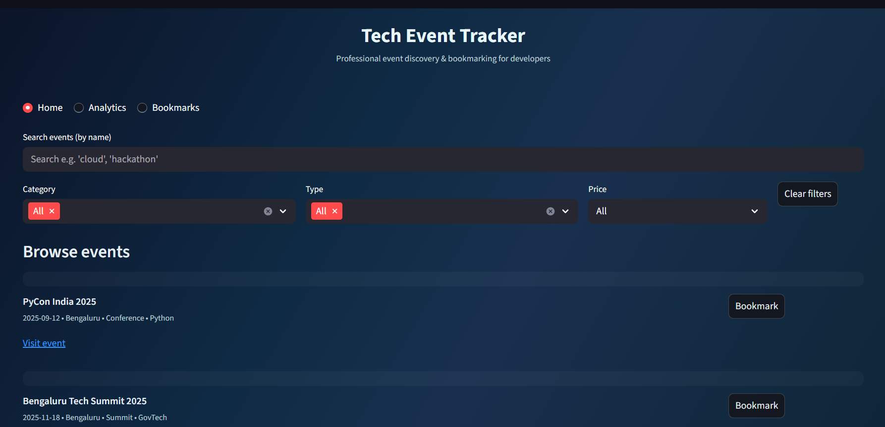

# 🚀 Tech Event Tracker

A modern **Streamlit web application** to explore, filter, and bookmark technology events across India.  
Easily track **free & paid events**, check event locations, and visualize analytics with interactive charts.  

---

## ✨ Features

- 🔍 **Smart Search & Filters**  
  Find events by **name, category, type, city, or price**.  

- 📌 **Bookmarking System**  
  Save your favorite events locally and remove them anytime.  

- 📊 **Analytics Dashboard**  
  - Free vs Paid event distribution  
  - Event locations across India  

- 🎨 **Attractive UI**  
  Dark-shaded theme with a clean, professional layout.  

- 📂 **CSV Support**  
  Use built-in dataset or upload your own `events.csv`.  

---

## 📸 Screenshot  



>

## ⚙️ Installation

Clone the repo and set up the environment:

```bash
# Clone repo
git clone https://github.com/your-username/tech-event-tracker.git
cd tech-event-tracker

# Create virtual environment
python -m venv venv

# Activate (Windows)
venv\Scripts\activate


# Install requirements
pip install -r requirements.txt
